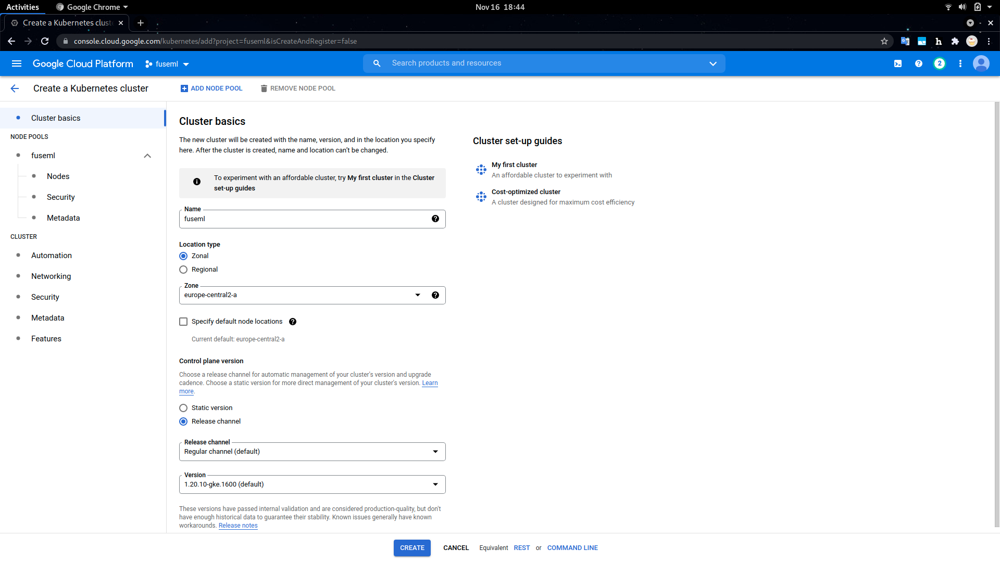
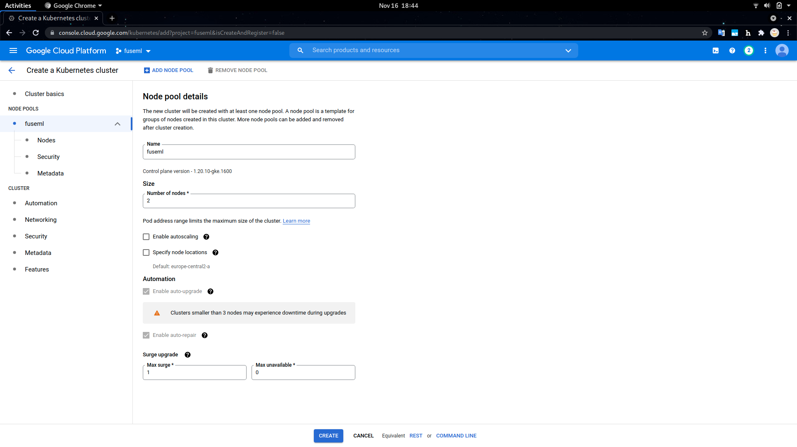
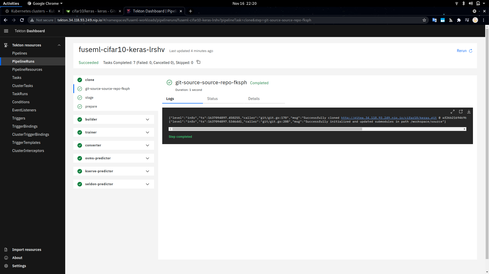

# Image classification with MLFlow and Intel OpenVINO

## Introduction

Analyzing the costs of deploying and operating ML models in production environments is a very important aspect of MLOps and Machine Learning projects. If not carefully considered, serving ML models can incur significant infrastructure and maintenance related costs, especially with bigger models. FuseML greatly simplifies the process of exploring various ML model serving platforms, as well as running inference performance testing, in order to identify a configuration that yields the ratio of cost vs. performance that best matches your ML model and business requirements.

This tutorial will showcase FuseML extensions that can be used to integrate Intel OpenVINO technologies into your MLOps project pipeline, more specifically the [OpenVINO Model Optimizer](https://docs.openvino.ai/latest/openvino_docs_MO_DG_Deep_Learning_Model_Optimizer_DevGuide.html) and the [Model Server](https://docs.openvino.ai/latest/openvino_docs_ovms.html).

You'll deploy a FuseML workflow to train a CNN model on the CIFAR-10 dataset and then serve it using three different ML serving tools and configurations. Afterwards, you'll run some performance testing on the deployed inference servers and interpret the results.

## Setup

### Infrastructure

This tutorial uses a GKE cluster explicitly configured to have Cascade or Skylake generation Intel processors, which are better suited for Intel accelerated ML workloads, but it should work on any other Kubernetes cluster. 

!!! note
    The FuseML workflow used in this tutorial includes some steps that make use of explicit CPU resource requests. For this reason, it is recommended that the Kubernetes nodes have at least 2 vCPUs each, preferably 4, otherwise the workflow steps might be stuck because they cannot be scheduled due to resource and placement constraints. The alternative, if an acceptable number of CPUs cannot be ensured for the Kubernetes nodes, is to edit the FuseML workflow to reduce or even eliminate the explicit CPU resource requirements. The cluster used in this tutorial has 2 nodes, each with 4 vCPUs.

Creating a GKE cluster using the [GCP console](https://console.cloud.google.com/kubernetes/) is a straightforward process, captured in the following screenshots. Note that we explicitly selected the N2 node type in the machine configuration to get access to the class of Intel CPUs that is best suited for OpenVINO.


<figure markdown> 
  
  <figcaption>GKE Cluster Basic Configuration Settings</figcaption>
</figure>

<figure markdown> 
  
  <figcaption>GKE Cluster Node Pool Configuration Settings</figcaption>
</figure>

<figure markdown> 
  
  <figcaption>GKE Cluster Node Configuration Settings</figcaption>
</figure>


Once the GKE cluster is deployed, you'll need the GCP SDK installed on your workstation to access its credentials. The installation process is thoroughly covered in [the official docs](https://cloud.google.com/sdk/docs/install).

To initialize the GCP SDK and authenticate with the same GCP credentials used to deploy the GKE cluster:

```bash
$ gcloud init
```

To retrieve the GKE kubernetes configuration (make sure you use the same project name and zone as the deployed cluster):

```bash
$ gcloud container clusters get-credentials fuseml --zone europe-central2-a --project fuseml
Fetching cluster endpoint and auth data.
kubeconfig entry generated for fuseml.
```

With the kubernetes configuration properly configured, you should now be able to access the cluster:

```bash
$ kubectl get node
NAME                              STATUS   ROLES    AGE     VERSION
gke-fuseml-fuseml-7e908893-69wp   Ready    <none>   2m15s   v1.20.10-gke.1600
gke-fuseml-fuseml-7e908893-cmjr   Ready    <none>   2m17s   v1.20.10-gke.1600
```

### FuseML

With the Kubernetes cluster set up, FuseML can be installed as covered in the [Quick Start](../quickstart.md) section:

```bash
$ fuseml-installer install

🚢 FuseML installing...

Configuration...
  🧭  system_domain: 
  🧭  extensions_repository: https://raw.githubusercontent.com/fuseml/extensions/release-0.3/installer/
  🧭  force_reinstall: false

🚢 Deploying Istio.....
✔️  Istio deployed
.....................................
✔️  Created system_domain: 34.118.93.249.nip.io

🚢 Deploying Workloads...
✔️  Workloads deployed

🚢 Deploying Gitea..............................................................
✔️  Gitea deployed (http://gitea.34.118.93.249.nip.io).

🚢 Deploying Registry.............................
✔️  Registry deployed

🚢 Deploying Tekton.........................................................................................
✔️  Tekton deployed (http://tekton.34.118.93.249.nip.io).

🚢 Deploying Core.....................
✔️  FuseML core component deployed (http://fuseml-core.34.118.93.249.nip.io).

🚢 Downloading command line client...
🚢 FuseML command line client saved as /home/snica/work/src/aiml/fuseml/fuseml.
Copy it to the location within your PATH (e.g. /usr/local/bin).

🚢 To use the FuseML CLI, you must point it to the FuseML server URL, e.g.:

    export FUSEML_SERVER_URL=http://fuseml-core.34.118.93.249.nip.io

✔️  FuseML installed.
System domain: 34.118.93.249.nip.io
```

Follow the instructions printed by the installer to copy the CLI binary and set the `FUSEML_SERVER_URL` environment variable to point to the FuseML installation. This is required to interact with the FuseML instance later through the FuseML CLI:

```bash
# alternatively, if you don't have sudo privileges and your PATH is set
# to include the ~/bin location, you can run: cp fuseml ~/bin
$ sudo cp fuseml /usr/local/bin
$ export FUSEML_SERVER_URL=http://fuseml-core.34.118.93.249.nip.io
```

Also take note of the URLs printed by the installer for the Gitea and Tekton built-in components. You can access these at any given time to get a detailed view of the underlying FuseML codesets and workflows, or to debug any problems that may appear.

In addition to FuseML and its builtin components, we also need MLFlow, the OpenVINO Model Server operator and two other prediction serving platforms, KServe and Seldon Core, that we'll use to run performance benchmark and compare results. All these tools can be installed through the use of FuseML installer extensions:

```bash
$ fuseml-installer extensions --add mlflow,ovms,kserve,seldon-core

🚢 FuseML handling the extensions...
.
🚢 Installing extension 'mlflow'....
✔️  mlflow accessible at http://mlflow.34.118.93.249.nip.io.
✔️  minio accessible at http://minio.34.118.93.249.nip.io
✔️  mlflow deployed.

🚢 Registering extension 'mlflow'...

🚢 Installing extension 'ovms'..................................
✔️  ovms deployed.

🚢 Registering extension 'ovms'...

🚢 Installing extension 'knative'......................................................................................................................................................................
✔️  knative deployed.

🚢 Registering extension 'knative'...

🚢 Installing extension 'cert-manager'...
✔️  cert-manager deployed.

🚢 Registering extension 'cert-manager'...

🚢 Installing extension 'kserve'......................................
✔️  kserve-web-app accessible at http://kserve-web-app.34.118.93.249.nip.io
✔️  kserve deployed.

🚢 Registering extension 'kserve'...

🚢 Installing extension 'seldon-core'......
✔️  seldon-core deployed.

🚢 Registering extension 'seldon-core'...
```

Some of the installed tools, like MLFlow and KServe, also feature dashboards that can be accessed to view detailed information about the ML artifacts and processes orchestrated by FuseML. Their URLs are also printed by the FuseML installer, as shown above.

The following FuseML CLI command verifies that all the AI/ML tools required for this tutorial have been installed and registered with the FuseML Extension Registry:

```bash
$ fuseml extension list
+--------------+-----------------------+---------+------+-------------------------------+-------------------------------------------+----------------------------+
| ID           | PRODUCT               | VERSION | ZONE | SERVICES                      | ENDPOINTS                                 | CREDENTIALS                |
+--------------+-----------------------+---------+------+-------------------------------+-------------------------------------------+----------------------------+
| cert-manager | cert-manager          | 1.5.4   |      |                               |                                           |                            |
| knative      | knative               | 1.0.0   |      |                               |                                           |                            |
| kserve       | kserve                | 0.7.0   |      | [ API ]                       | [ API ]                                   |                            |
|              |                       |         |      | resource: kserve-api          | internal: http://kubernetes.default.svc   |                            |
|              |                       |         |      | category: prediction-serving  |                                           |                            |
|              |                       |         |      |                               |                                           |                            |
|              |                       |         |      | [ UI ]                        |                                           |                            |
|              |                       |         |      | resource: kserve-ui           |                                           |                            |
|              |                       |         |      | category: UI                  |                                           |                            |
|              |                       |         |      |                               |                                           |                            |
|              |                       |         |      |                               |                                           |                            |
| mlflow       | mlflow                | 1.20.2  |      | [ mlflow-tracking ]           | [ mlflow-tracking ]                       | [ mlflow-store ]           |
|              |                       |         |      | resource: mlflow-tracking     | internal: http://mlflow.mlflow            | default-s3-account: global |
|              |                       |         |      | category: experiment-tracking |                                           |                            |
|              |                       |         |      |                               | [ mlflow-store ]                          |                            |
|              |                       |         |      | [ mlflow-store ]              | internal: http://mlflow-minio.mlflow:9000 |                            |
|              |                       |         |      | resource: s3                  |                                           |                            |
|              |                       |         |      | category: model-store         |                                           |                            |
|              |                       |         |      |                               |                                           |                            |
|              |                       |         |      |                               |                                           |                            |
| ovms         | openvino-model-server | 0.1.0   |      | [ API ]                       | [ API ]                                   |                            |
|              |                       |         |      | resource: ovms-operator       | internal: http://kubernetes.default.svc   |                            |
|              |                       |         |      | category: prediction-serving  |                                           |                            |
|              |                       |         |      |                               |                                           |                            |
|              |                       |         |      |                               |                                           |                            |
| seldon-core  | seldon-core           | 1.11.0  |      | [ API ]                       | [ API ]                                   |                            |
|              |                       |         |      | resource: seldon-core-api     | internal: http://kubernetes.default.svc   |                            |
|              |                       |         |      | category: prediction-serving  |                                           |                            |
|              |                       |         |      |                               |                                           |                            |
|              |                       |         |      |                               |                                           |                            |
+--------------+-----------------------+---------+------+-------------------------------+-------------------------------------------+----------------------------+
```

## Training & Serving the Model

We will be training a
[Convolutional Neural Network (CNN)](https://developers.google.com/machine-learning/glossary/#convolutional_neural_network)
to classify [CIFAR-10 images](https://www.cs.toronto.edu/~kriz/cifar.html) using the Keras Sequential API.
The complete original code for the model training is available [here](https://github.com/fuseml/examples/tree/release-0.3/codesets/mlflow/keras). The code we're using in this tutorial is a modified version of the original: the model architecture has been slightly changed, to make the model converge faster and to yield better results, based on recommendations from [this Machine Learning Mastery article](https://machinelearningmastery.com/how-to-develop-a-cnn-from-scratch-for-cifar-10-photo-classification/).

### Training & Serving using FuseML

The following steps describe how to use FuseML to train the Keras CIFAR-10 model and serve it.

1. Clone the `fuseml/examples` repository and register the `keras` example code as a FuseML codeset:

    ```bash
    $ git clone --depth 1 -b release-0.3 https://github.com/fuseml/examples.git

    $ fuseml codeset register -n keras -p cifar10 examples/codesets/mlflow/keras
    2021/11/16 19:06:47 Pushing the code to the git repository...
    Codeset http://gitea.34.118.93.249.nip.io/cifar10/keras.git successfully registered
    Saving new username into config file as current username.
    ```

    The codeset and its contents can be explored in the Gitea dashboard by following the printed URL, as shown below.


    <figure markdown> 
      
      <figcaption>Codeset Details in the Gitea Dashboard</figcaption>
    </figure>

    The Keras codeset includes a `MLproject` file. This is an MLFlow convention used to specify software dependencies, entrypoints and input parameters for the code present in the codeset. This vital piece of information is leveraged by the FuseML workflow that will be configured at the next step to determine automatically which software packages it needs to install and how to run the code in the codeset to train the Keras model.

2. Create a FuseML workflow:

    Before configuring the FuseML workflow used in this tutorial, take some time to explore it by looking at its definition in the `examples/workflows/mlflow-multi-e2e.yaml` file. Observe the following:
    
    - the workflow has 3 different predictor steps, each one targeting a different serving solution (OVMS, KServe and Seldon Core). They all take in the same model artifact that comes out of the training step.
    - the `app_name` input parameter is explicitly set for all predictor steps to ensure reproducible application names for the prediction services deployed by the workflow. These are also reflected in the URLs where prediction services accept inference requests.
    - the OVMS predictor needs the model to be converted to the Intel IR (Intermediate Representation) format. This is facilitated by a converter step.
    - there are explicit CPU resource requests specified for the training and OVMS serving steps. They are meant to speed up the training process and to give the OVMS predictor access to an entire vCPU. Feel free to edit the workflow and change the resource requirements to fit your scenario. Note that the Kubernetes cluster needs to have these resources available, otherwise the workflow will fail because the step containers cannot be scheduled.
    - the default values for the workflow input parameters specify training the model for 30 epochs. This will take approximately 40 minutes and yield an accuracy close to 0.8. You can modify these parameters to experiment with different values.

    To configure the FuseML workflow:

    ```bash
    $ fuseml workflow create examples/workflows/mlflow-multi-e2e.yaml
    Workflow "mlflow-multi-e2e" successfully created
    ```


3. Assign the `mlflow-multi-e2e` workflow to the `keras` codeset:

    ```bash
    $ fuseml workflow assign --codeset-name keras --codeset-project cifar10 --name mlflow-multi-e2e
    Workflow "mlflow-multi-e2e" assigned to codeset "cifar10/keras"
    ```

4. Wait for the workflow run to finish running:

    By assigning the workflow to the codeset, a workflow run will be created. You can check the status
    of the workflow run by running the following command:

    ```bash
    $ fuseml workflow list-runs
    +----------------------------+------------------+----------------+------------+------------------+
    | NAME                       | WORKFLOW         | STARTED        | DURATION   | STATUS           |
    +----------------------------+------------------+----------------+------------+------------------+
    | fuseml-cifar10-keras-lrshv | mlflow-multi-e2e | 19 seconds ago | ---        | Running          |
    +----------------------------+------------------+----------------+------------+------------------+
    ```

    You can also see a detailed view of the workflow run through the Tekton dashboard. The URL where
    the dashboard can be accessed was printed during the FuseML installation and has the form:
    `http://tekton.<FUSEML_DOMAIN>`, where `FUSEML_DOMAIN` is the common _.nip.io_ domain name used for
    all services. In our case, this is `http://tekton.34.118.93.249.nip.io`.


    <figure markdown> 
      
      <figcaption>View of the Workflow in Progress in the Tekton Dashboard</figcaption>
    </figure>

    Aside from the long training time, note that since this is the first time the workflow is running, it will build a docker image including the software dependencies for training the model which may take a while. However, consecutive runs will skip that step as long as the dependencies are kept the same.

    <figure markdown> 
      
      <figcaption>View of the Completed Workflow in the Tekton Dashboard</figcaption>
    </figure>


### Validating the Deployed Model

Before querying the served model for predictions, let's take a look at MLflow for detailed information about
the model, such as its accuracy, loss, training parameters, etc.

The MLflow dashboard is available at the `http://mlflow.<FUSEML_DOMAIN>` URL printed during installation, more specifically at `http://mlflow.34.118.93.249.nip.io` in our particular case. The `keras-cifar10` MLFlow experiment contains all tracking information about the model being trained by our workflow. 

For example:

<figure markdown> 
  
  <figcaption>Model Training Metrics Plotted Over Time</figcaption>
</figure>

<figure markdown> 
  
  <figcaption>Model Training Metrics Plotted Over Number of Epochs</figcaption>
</figure>

Note the accuracy (about 80%) and the training duration (about 40 minutes) for 30 epochs. Also note that the model is converging nicely, indicated by how the two curves, the training and evaluation accuracy, are almost fully aligned.

With the successful execution of the workflow, three new FuseML applications should have been created, one for each available prediction serving platform. Listing the FuseML applications will show the URLs where the prediction servers can receive inference requests:

```bash
$ fuseml application list
+----------------+-----------+---------------------------------------------------------------------------------------------------------+---------------------------------------------------------------------------------------------------------------------------+------------------+
| NAME           | TYPE      | DESCRIPTION                                                                                             | URL                                                                                                                       | WORKFLOW         |
+----------------+-----------+---------------------------------------------------------------------------------------------------------+---------------------------------------------------------------------------------------------------------------------------+------------------+
| cifar10-kserve | predictor | KServe service deployed for s3://mlflow-artifacts/1/7b1549fc8c3a45189564c521f9313a66/artifacts/model    | http://cifar10-kserve.fuseml-workloads.34.118.93.249.nip.io/v1/models/cifar10-kserve:predict                              | mlflow-multi-e2e |
| cifar10-ovms   | predictor | OVMS service deployed for s3://mlflow-artifacts/1/7b1549fc8c3a45189564c521f9313a66/artifacts/model/ovms | http://cifar10-ovms.ovms.34.118.93.249.nip.io/v1/models/default:predict                                                   | mlflow-multi-e2e |
| cifar10-seldon | predictor | Application generated by mlflow-multi-e2e workflow                                                      | http://cifar10-seldon.seldon.34.118.93.249.nip.io/seldon/fuseml-workloads/cifar10-seldon/v1/models/cifar10-seldon:predict | mlflow-multi-e2e |
+----------------+-----------+---------------------------------------------------------------------------------------------------------+---------------------------------------------------------------------------------------------------------------------------+------------------+
```

The list of FuseML applications include a URL to query the model for predictions. In addition to the URLs, since our workflow includes a KServe prediction service, you can also check the deployed models through the KServe
dashboard (`http://kserve-web-app.<FUSEML_DOMAIN>/`, in our case `http://kserve-web-app.34.118.93.249.nip.io/`) which also includes more detailed information, such as the status of the deployment, logs, etc.

For example:

<figure markdown> 
  
  <figcaption>KFServing Dashboard</figcaption>
</figure>

To validate the model, we need to send one or more requests containing images to the prediction service and check if the model classifies them correctly. Some sample images are included in `examples/prediction/images/cifar10` folder for this purpose. To simplify the process of converting them in the right format and constructing the prediction requests, we'll use some helper scripts available in the `examples/prediction/images` folder. First, we need to install some requirements:

```
$ cd examples/prediction/images
$ python3 -m venv .venv
$ source .venv/bin/activate
$ pip install -r requirements.txt
```

Before we can run the actual prediction requests, we need to convert the images in the sample set to a numpy dataset format:

```
$ python img_to_npy.py --image_dir cifar10 --label_file cifar10/images.txt --input_height 32 --input_width 32 --resize --output_file dataset.npy --output_label_file labels.npy

-------------------------------------
3.6.13 (default, Mar 10 2021, 18:30:35) [GCC]
-------------------------------------
 Command line options:
--image_dir           :  .
--label_file          :  images.txt
--classes             :  1000
--input_height        :  32
--input_width         :  32
--input_chans         :  3
--resize              :  True
--normalize           :  False
--one_hot             :  False
--compress            :  False
--output_file         :  dataset.npy
--output_label_file   :  labels.npy
-------------------------------------
 x shape: (10, 32, 32, 3)
 x data type: uint8
 y shape: (10,)
 y data type: uint16
 Data saved to dataset.npy
 Labels saved to labels.npy
```

The numpy datasets are required to run prediction queries with the OpenVINO Model Server client script. We'll do that separately for each of the deployed prediction servers:

- for OVMS (note that we need to use a batch size of 1, due to a [current limitation in the OVMS operator 0.1 version](https://github.com/openvinotoolkit/openvino/issues/8607)):

    ```
    $ python rest_serving_client.py --rest_url http://cifar10-ovms.ovms.34.118.93.249.nip.io --model_name default --images_numpy_path dataset.npy --labels_numpy_path labels.npy --transpose_input False  --batchsize 1 --classes classes.json
    Image data range: 0 : 255
    Start processing:
      Model name: default
      Iterations: 10
      Images numpy path: dataset.npy
      Images in shape: (10, 32, 32, 3)

    output shape: (1, 10)
    Iteration 1; Processing time: 166.36 ms; speed 6.01 fps
    imagenet top results in a single batch:
      0 Airplane 0 ; Correct match.
    output shape: (1, 10)
    Iteration 2; Processing time: 70.00 ms; speed 14.28 fps
    imagenet top results in a single batch:
      0 Automobile 1 ; Correct match.
    output shape: (1, 10)
    Iteration 3; Processing time: 51.41 ms; speed 19.45 fps
    imagenet top results in a single batch:
      0 Horse 7 ; Incorrect match. Should be Bird 2
    output shape: (1, 10)
    Iteration 4; Processing time: 53.72 ms; speed 18.62 fps
    imagenet top results in a single batch:
      0 Cat 3 ; Correct match.
    output shape: (1, 10)
    Iteration 5; Processing time: 59.02 ms; speed 16.94 fps
    imagenet top results in a single batch:
      0 Horse 7 ; Incorrect match. Should be Deer 4
    output shape: (1, 10)
    Iteration 6; Processing time: 59.73 ms; speed 16.74 fps
    imagenet top results in a single batch:
      0 Truck 9 ; Incorrect match. Should be Dog 5
    output shape: (1, 10)
    Iteration 7; Processing time: 51.85 ms; speed 19.29 fps
    imagenet top results in a single batch:
      0 Frog 6 ; Correct match.
    output shape: (1, 10)
    Iteration 8; Processing time: 64.12 ms; speed 15.59 fps
    imagenet top results in a single batch:
      0 Horse 7 ; Correct match.
    output shape: (1, 10)
    Iteration 9; Processing time: 61.07 ms; speed 16.37 fps
    imagenet top results in a single batch:
      0 Ship 8 ; Correct match.
    output shape: (1, 10)
    Iteration 10; Processing time: 51.91 ms; speed 19.27 fps
    imagenet top results in a single batch:
      0 Truck 9 ; Correct match.

    processing time for all iterations
    average time: 68.50 ms; average speed: 14.60 fps
    median time: 59.00 ms; median speed: 16.95 fps
    max time: 166.00 ms; min speed: 6.02 fps
    min time: 51.00 ms; max speed: 19.61 fps
    time percentile 90: 79.60 ms; speed percentile 90: 12.56 fps
    time percentile 50: 59.00 ms; speed percentile 50: 16.95 fps
    time standard deviation: 33.05
    time variance: 1092.45
    Classification accuracy: 70.00
    ```

- for KServe:

    ```
    $ python rest_serving_client.py --rest_url http://cifar10-kserve.fuseml-workloads.34.118.93.249.nip.io --model_name cifar10-kserve --images_numpy_path dataset.npy --labels_numpy_path labels.npy --transpose_input False  --batchsize 10 --classes classes.json
    Image data range: 0 : 255
    Start processing:
      Model name: cifar10-kserve
      Iterations: 1
      Images numpy path: dataset.npy
      Images in shape: (10, 32, 32, 3)

    output shape: (10, 10)
    Iteration 1; Processing time: 411.55 ms; speed 24.30 fps
    imagenet top results in a single batch:
      0 Airplane 0 ; Correct match.
      1 Automobile 1 ; Correct match.
      2 Horse 7 ; Incorrect match. Should be Bird 2
      3 Cat 3 ; Correct match.
      4 Horse 7 ; Incorrect match. Should be Deer 4
      5 Truck 9 ; Incorrect match. Should be Dog 5
      6 Frog 6 ; Correct match.
      7 Horse 7 ; Correct match.
      8 Ship 8 ; Correct match.
      9 Truck 9 ; Correct match.

    processing time for all iterations
    average time: 411.00 ms; average speed: 24.33 fps
    median time: 411.00 ms; median speed: 24.33 fps
    max time: 411.00 ms; min speed: 24.33 fps
    min time: 411.00 ms; max speed: 24.33 fps
    time percentile 90: 411.00 ms; speed percentile 90: 24.33 fps
    time percentile 50: 411.00 ms; speed percentile 50: 24.33 fps
    time standard deviation: 0.00
    time variance: 0.00
    Classification accuracy: 70.00
    ```

- finally, for Seldon Core:

    ```
    $ python rest_serving_client.py --rest_url http://cifar10-seldon.seldon.34.118.93.249.nip.io/seldon/fuseml-workloads/cifar10-seldon --model_name cifar10-seldon --images_numpy_path dataset.npy --labels_numpy_path labels.npy --transpose_input False  --batchsize 10 --classes classes.json
    Image data range: 0 : 255
    Start processing:
      Model name: cifar10-seldon
      Iterations: 1
      Images numpy path: dataset.npy
      Images in shape: (10, 32, 32, 3)

    output shape: (10, 10)
    Iteration 1; Processing time: 424.69 ms; speed 23.55 fps
    imagenet top results in a single batch:
      0 Airplane 0 ; Correct match.
      1 Automobile 1 ; Correct match.
      2 Horse 7 ; Incorrect match. Should be Bird 2
      3 Cat 3 ; Correct match.
      4 Horse 7 ; Incorrect match. Should be Deer 4
      5 Truck 9 ; Incorrect match. Should be Dog 5
      6 Frog 6 ; Correct match.
      7 Horse 7 ; Correct match.
      8 Ship 8 ; Correct match.
      9 Truck 9 ; Correct match.

    processing time for all iterations
    average time: 424.00 ms; average speed: 23.58 fps
    median time: 424.00 ms; median speed: 23.58 fps
    max time: 424.00 ms; min speed: 23.58 fps
    min time: 424.00 ms; max speed: 23.58 fps
    time percentile 90: 424.00 ms; speed percentile 90: 23.58 fps
    time percentile 50: 424.00 ms; speed percentile 50: 23.58 fps
    time standard deviation: 0.00
    time variance: 0.00
    Classification accuracy: 70.00
    ```

### Benchmarking the Inference Services

To be able to compare the performance of the different model serving tools, we can benchmark the inference services.

Run the following command to create a Job workload that will benchmark the OVMS inference service:

```bash
$ kubectl apply -f cifar10/perf.yaml
job.batch/load-test created
configmap/load-test-cfg created
```

Wait for the Job to complete and check the logs for the results:

```bash
$ kubectl wait --for=condition=complete --timeout 120s job -l app=load-test && kubectl logs -l app=load-test
job.batch/load-test condition met
Requests      [total, rate, throughput]         3000, 50.02, 50.01
Duration      [total, attack, wait]             59.982s, 59.98s, 2.471ms
Latencies     [min, mean, 50, 90, 95, 99, max]  1.89ms, 2.178ms, 2.093ms, 2.343ms, 2.525ms, 3.294ms, 11.482ms
Bytes In      [total, mean]                     459000, 153.00
Bytes Out     [total, mean]                     340392000, 113464.00
Success       [ratio]                           100.00%
Status Codes  [code:count]                      200:3000  
Error Set:
```

To run the same load test against the KServe prediction service, we need to manually edit the `cifar10/perf.yaml` file and replace the OVMS URL with the KServe URL documented in the enclosed comments, e.g.:

```yaml
...
data:
  # http://ovms-cifar10-ovms.fuseml-workloads:8081/v1/models/default:predict
  # http://cifar10-kserve-predictor-default.fuseml-workloads/v1/models/cifar10-kserve:predict
  # http://cifar10-seldon-predictor.fuseml-workloads:8000/v1/models/cifar10-seldon:predict
  cfg: |
    POST http://cifar10-kserve-predictor-default.fuseml-workloads/v1/models/cifar10-kserve:predict
    @/var/vegeta/payload
...
```

Then, clean up the previous job and run it again:

```bash
$ kubectl delete job -l app=load-test
job.batch "load-test" deleted
$ kubectl delete cm load-test-cfg
configmap "load-test-cfg" deleted
$ kubectl apply -f cifar10/perf.yaml 
job.batch/load-test created
configmap/load-test-cfg configured
```

```bash
$ kubectl wait --for=condition=complete --timeout 120s job -l app=load-test && kubectl logs -l app=load-test
job.batch/load-test condition met
Requests      [total, rate, throughput]         3000, 50.02, 50.01
Duration      [total, attack, wait]             59.984s, 59.98s, 3.826ms
Latencies     [min, mean, 50, 90, 95, 99, max]  3.359ms, 4.192ms, 4.067ms, 4.685ms, 5.023ms, 6.854ms, 27.131ms
Bytes In      [total, mean]                     450000, 150.00
Bytes Out     [total, mean]                     340392000, 113464.00
Success       [ratio]                           100.00%
Status Codes  [code:count]                      200:3000  
Error Set:
```

Repeat the process to run the load test against the Seldon Core prediction service:

```bash
$ kubectl delete job -l app=load-test
job.batch "load-test" deleted
$ kubectl delete cm load-test-cfg
configmap "load-test-cfg" deleted
$ kubectl apply -f cifar10/perf.yaml 
job.batch/load-test created
configmap/load-test-cfg configured
```

```bash
$ kubectl wait --for=condition=complete --timeout 120s job -l app=load-test && kubectl logs -l app=load-test
job.batch/load-test condition met
Requests      [total, rate, throughput]         3000, 50.02, 50.01
Duration      [total, attack, wait]             59.985s, 59.98s, 5.465ms
Latencies     [min, mean, 50, 90, 95, 99, max]  4.367ms, 5.843ms, 5.31ms, 8.374ms, 9.25ms, 10.835ms, 18.457ms
Bytes In      [total, mean]                     450000, 150.00
Bytes Out     [total, mean]                     340392000, 113464.00
Success       [ratio]                           100.00%
Status Codes  [code:count]                      200:3000  
Error Set:
```

The results show that the OVMS prediction service yields better results with regards to latency, when compared to the other two. This is largely due to the fact that the OVMS prediction service is running an optimized version of the model and it's leveraging Intel CPU acceleration features.

## Conclusion

This tutorial demonstrates how FuseML can be used to train and serve the same model on different prediction platforms for the purpose of benchmarking. Benchmark results can be used to greatly reduce costs related to running models in production. In addition, the particular benchmarking results covered in the tutorial show that serving an optimized model using a prediction service such as the OpenVINO Model Server can yield better results, even if we're only using CPUs to run predictions.
